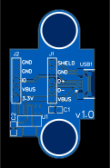

# USB micro B right angle breakout

Breakout board for a right angle USB micro B connector.

The board has two M3 mounting holes that are positioned so that they can be used to mount the board to a base plate or to a side panel (using a pair of L brackets).

This board uses the same type of USB connector as the [USB micro B Vertical breakout](../USB%20micro%20B%20Vert%20breakout) board.
This board differs from the "Vertical" board in the following ways:

* this board has a right angle connector instead of a vertical connector (meaning it mounts to a panel or case differently)
* this board features the 3.3 volt regulator
* this board uses surface mount components

TODO: Add photo of completed board

## Licence

Copyright © 2023 Phil Baldwin

This work is licensed under a Creative Commons Attribution-ShareAlike 4.0 International License.

You should have received a copy of the license along with this work. If not, see <http://creativecommons.org/licenses/by-sa/4.0/>.
