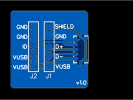
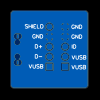

# USB micro B male breakout

Breakout board for a male USB micro B connector.

This board is intended to plug into device (for example boards such as the Raspberry Pi Pico or the Teensy), to provide power and possible USB connections to the board. Therefore this breakout board does not have mounting holes

TODO: Add photo of completed board

## Licence

Copyright © 2023 Phil Baldwin

This work is licensed under a Creative Commons Attribution-ShareAlike 4.0 International License.

You should have received a copy of the license along with this work. If not, see <http://creativecommons.org/licenses/by-sa/4.0/>.
